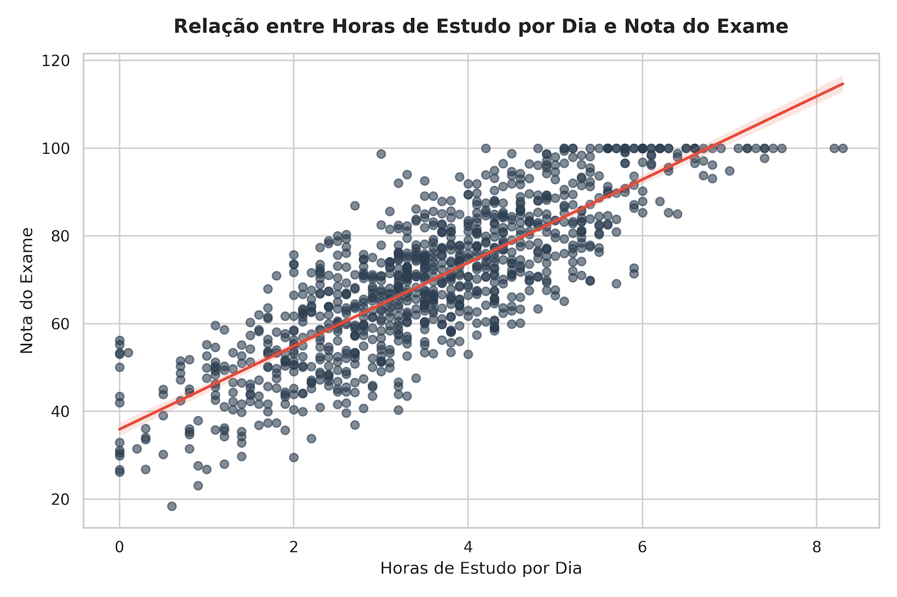
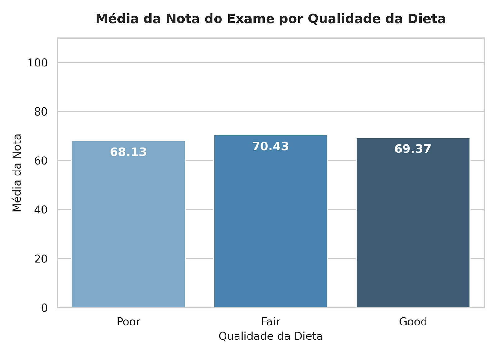

# Repositorio com intuito de treinamento e estudo 
## Analise de relação horas de estudo x nota no exame com o auxilio de AI GEMINI.AI

### O intuito era anotar e analisar as infomarções fornecidas pela AI em situações diferentes, como por exemplo o contexto em seus prompts

Ao decorrer das atividades conseguimos perceber mudanças e variaçoes em suas respostas, conseguimos analises mais complexas e detalhadas sobre o mesmo assunto.

## Acompanhe e veja os mapas e graficos para melhor entendimento. 

Por fim, observe as notas e se certifique de sempre verificar as informações fornecidas pela IA.
Muito Obrigado por ler!

---
Caso deseje testar:
```
pip install pandas seaborn numpy
```
---

Resumo dos assuntos dentro deste repositorio:

---
📊 Resumo dos Principais Influenciadores (Correlação):
Horas de Estudo por Dia: $+0,83$
Saúde Mental : $+0,32$
Frequência de Exercícios : $+0,16$
Horas de Netflix: $-0,17$ 
Horas de Redes Sociais : $-0,17$
---


```
import pandas as pd
import matplotlib.pyplot as plt
import seaborn as sns

# Carregar dados
df = pd.read_csv('base_estudantes_tratado.csv')

# Calcular a média, desvio padrão e contagem por grupo de qualidade da dieta
summary_diet = df.groupby('diet_quality')['exam_score'].agg(['count', 'mean', 'std']).reset_index()
print(summary_diet)

# Criar um gráfico de barras para ilustrar as médias
sns.set_theme(style="whitegrid")
fig, ax = plt.subplots(figsize=(7, 5))

# Ordem desejada das categorias
ordem = ['Poor', 'Fair', 'Good']

sns.barplot(
    data=df, 
    x='diet_quality', 
    y='exam_score', 
    order=ordem, 
    ax=ax, 
    palette='Blues_d',
    errorbar=None # Remove barras de erro para focar na média pura
)

# Adicionar os valores exatos no topo das barras
for p in ax.patches:
    ax.annotate(f"{p.get_height():.2f}", 
                (p.get_x() + p.get_width() / 2., p.get_height() - 5), 
                ha='center', va='center', 
                color='white', fontweight='bold', 
                xytext=(0, 0), textcoords='offset points')

ax.set_title('Média da Nota do Exame por Qualidade da Dieta', fontsize=13, fontweight='bold', pad=15)
ax.set_xlabel('Qualidade da Dieta', fontsize=11)
ax.set_ylabel('Média da Nota', fontsize=11)
ax.set_ylim(0, 110)

plt.tight_layout()
plt.savefig('media_nota_por_dieta.png', dpi=300)
plt.close()
```
---


---

Olhando puramente para os números, a qualidade da dieta não faz uma diferença expressiva na nota final do exame.

Embora os alunos com uma dieta ruim (Poor) tenham uma média ligeiramente menor, a variação entre os três grupos é muito sutil (menos de 2,5 pontos de diferença entre a maior e a menor média). Além disso, o desvio padrão em todos os grupos é de aproximadamente 17 pontos, o que significa que há uma alta variação de notas dentro de cada próprio grupo.

E assim analisando mais itens que foram possiveis graças as capacidades de assimilação e reconhecimento da inteligencia artificial, para mais fique a vontade para explorar.

(Trabalho realizado na instituição SENAI de AMERICANA)